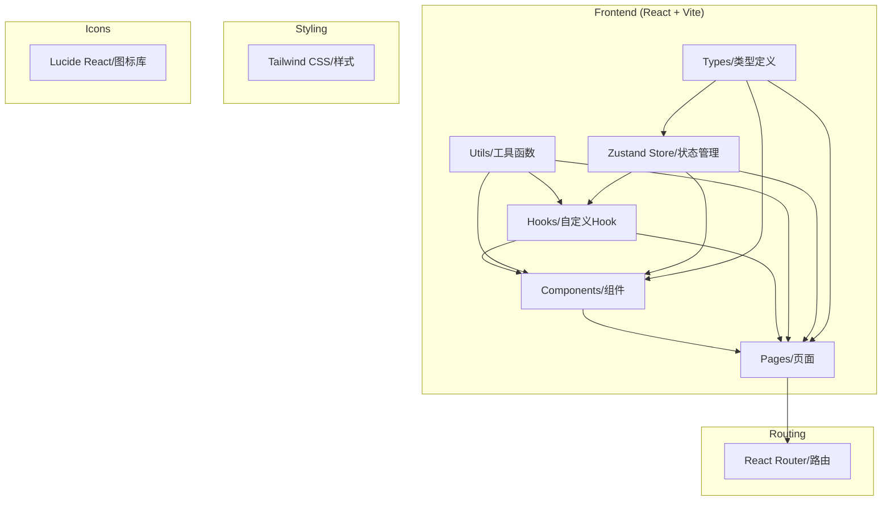
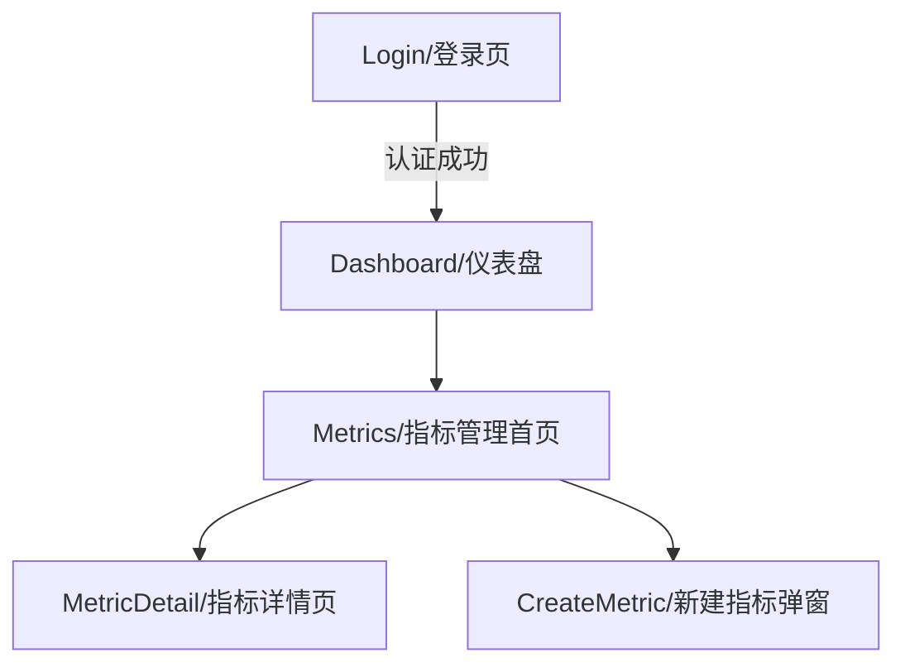

# 指标管理系统 - 技术架构文档

## 1. Architecture Design

### 1.1 系统架构图



### 1.2 页面路由结构



## 2. Technology Stack

### 2.1 Frontend
- **Framework**: React 18 + TypeScript
- **Build Tool**: Vite
- **Styling**: Tailwind CSS
- **State Management**: Zustand
- **Routing**: React Router DOM v7
- **Icons**: Lucide React
- **Utilities**: clsx, tailwind-merge

### 2.2 Backend
- **Status**: 暂不实现
- **Data Source**: Mock Data (本地模拟数据)
- **Future**: RESTful API

### 2.3 Deployment
- **Platform**: Tencent CloudBase (静态网站托管)
- **CI/CD**: GitHub Actions
- **URL**: https://zhyz-d5gn0hcks8376e692-1433390963.tcloudbaseapp.com/

## 3. File Structure

```
/workspace
├── .github/
│   └── workflows/
│       └── cloudbase-deploy.yml    # GitHub Actions部署配置
├── .trae/
│   └── documents/
│       ├── prd.md                 # 产品需求文档
│       └── arch.md                # 技术架构文档
├── src/
│   ├── components/               # 可复用组件
│   │   ├── ui/                   # 基础UI组件
│   │   ├── layout/               # 布局组件
│   │   └── business/             # 业务组件
│   ├── pages/                    # 页面组件
│   │   ├── Login.tsx             # 登录页
│   │   ├── Dashboard.tsx         # 仪表盘
│   │   ├── Metrics/              # 指标管理模块
│   │   │   ├── index.tsx         # 指标管理首页
│   │   │   ├── Detail.tsx        # 指标详情页
│   │   │   └── Create/           # 新建指标弹窗
│   │   │       ├── RootModal.tsx     # 1级指标
│   │   │       ├── BasicModal.tsx     # 2级指标
│   │   │       ├── ResultModal.tsx    # 3级指标
│   │   │       └── ComputeModal.tsx   # 4级指标
│   │   └── Users.tsx             # 用户管理
│   ├── hooks/                    # 自定义Hooks
│   │   ├── useAuth.ts           # 认证Hook
│   │   ├── useMetrics.ts        # 指标Hook
│   │   └── useTree.ts           # 树形结构Hook
│   ├── utils/                    # 工具函数
│   │   ├── cn.ts                # className合并
│   │   └── formatters.ts        # 格式化函数
│   ├── store/                    # Zustand状态管理
│   │   ├── authStore.ts         # 认证状态
│   │   └── metricStore.ts       # 指标状态
│   ├── types/                    # TypeScript类型定义
│   │   ├── auth.ts              # 认证类型
│   │   ├── metric.ts            # 指标类型
│   │   └── tree.ts              # 树形结构类型
│   ├── data/                     # Mock数据
│   │   └── metrics.ts            # 指标Mock数据
│   ├── App.tsx                  # 根组件
│   ├── main.tsx                 # 入口文件
│   └── index.css                # 全局样式
├── public/                       # 静态资源
├── index.html                   # HTML模板
├── package.json                 # 依赖配置
├── tsconfig.json               # TypeScript配置
├── vite.config.ts              # Vite配置
├── tailwind.config.js          # Tailwind配置
├── postcss.config.js           # PostCSS配置
├── cloudbaserc.json            # CloudBase配置
└── .gitignore                  # Git忽略文件
```

## 4. Core Data Models

### 4.1 Metric (指标)

```typescript
interface Metric {
  id: string;                    // 指标ID
  name: string;                  // 指标名称
  englishName: string;           // 英文名
  level: 1 | 2 | 3 | 4;         // 指标级别
  parentId?: string;             // 父指标ID
  description?: string;           // 描述
  businessOwner?: string;         // 业务负责人
  developer?: string;             // 开发负责人
  status: 'draft' | 'published'; // 状态
  sql?: string;                  // SQL语句（2级指标）
  createdAt: string;             // 创建时间
  updatedAt: string;             // 更新时间
  version: number;               // 版本号
}

interface MetricVersion {
  id: string;                    // 版本ID
  metricId: string;              // 指标ID
  version: number;               // 版本号
  changes: string;               // 变更内容
  createdBy: string;             // 创建人
  createdAt: string;             // 创建时间
}

interface MetricLineage {
  id: string;                    // 血缘ID
  metricId: string;              // 指标ID
  upstream: string[];            // 上游指标ID列表
  downstream: string[];           // 下游指标ID列表
}
```

### 4.2 TreeNode (目录树节点)

```typescript
interface TreeNode {
  id: string;                    // 节点ID
  name: string;                  // 节点名称
  level: number;                 // 层级
  children?: TreeNode[];         // 子节点
  expanded?: boolean;            // 是否展开
  selected?: boolean;            // 是否选中
  metricId?: string;             // 关联的指标ID
}
```

## 5. Component Architecture

### 5.1 Directory Tree Component

```typescript
// 目录树组件
interface TreeProps {
  data: TreeNode[];
  onSelect: (node: TreeNode) => void;
  onContextMenu: (event: React.MouseEvent, node: TreeNode) => void;
}

// 树节点组件
interface TreeNodeProps {
  node: TreeNode;
  onSelect: (node: TreeNode) => void;
  onToggle: (node: TreeNode) => void;
  onContextMenu: (event: React.MouseEvent, node: TreeNode) => void;
}
```

### 5.2 Metric List Component

```typescript
// 指标列表组件
interface MetricListProps {
  data: Metric[];
  loading?: boolean;
  pagination?: {
    current: number;
    pageSize: number;
    total: number;
    onChange: (page: number, pageSize: number) => void;
  };
  onView: (metric: Metric) => void;
  onEdit: (metric: Metric) => void;
  onDelete: (metric: Metric) => void;
}
```

### 5.3 Create Modal Components

```typescript
// 新建指标弹窗
interface CreateModalProps {
  visible: boolean;
  level: 1 | 2 | 3 | 4;
  parentId?: string;
  onCancel: () => void;
  onSubmit: (data: Partial<Metric>) => void;
}

// 1级指标表单
interface RootMetricForm {
  name: string;
  englishName: string;
  description?: string;
}

// 2级指标表单（继承1级 + SQL）
interface BasicMetricForm extends RootMetricForm {
  sql: string;
}

// 3级指标表单（继承2级）
interface ResultMetricForm extends BasicMetricForm {
  resultField: string;
}

// 4级指标表单（继承3级）
interface ComputeMetricForm extends ResultMetricForm {
  computeRule: string;
}
```

### 5.4 Metric Detail Component

```typescript
// 指标详情组件
interface MetricDetailProps {
  metricId: string;
}

// Tab类型
type DetailTab = 'basic' | 'preview' | 'lineage' | 'version' | 'family';

// 指标详情Props
interface MetricDetailProps {
  metricId: string;
  activeTab: DetailTab;
  onTabChange: (tab: DetailTab) => void;
}
```

## 6. State Management

### 6.1 Auth Store

```typescript
interface AuthState {
  user: User | null;
  isAuthenticated: boolean;
  isLoading: boolean;
  login: (username: string, password: string) => Promise<boolean>;
  logout: () => void;
}
```

### 6.2 Metric Store

```typescript
interface MetricState {
  // 指标列表
  metrics: Metric[];
  loading: boolean;
  
  // 目录树
  treeData: TreeNode[];
  selectedNode: TreeNode | null;
  expandedKeys: string[];
  
  // 筛选和分页
  filters: {
    search?: string;
    level?: number;
    status?: string;
  };
  pagination: {
    current: number;
    pageSize: number;
    total: number;
  };
  
  // 操作
  fetchMetrics: () => Promise<void>;
  createMetric: (data: Partial<Metric>) => Promise<void>;
  updateMetric: (id: string, data: Partial<Metric>) => Promise<void>;
  deleteMetric: (id: string) => Promise<void>;
  
  // 树操作
  selectNode: (node: TreeNode) => void;
  toggleExpand: (key: string) => void;
}
```

## 7. Routing Configuration

```typescript
const routes = [
  {
    path: '/login',
    component: Login,
    meta: { requiresAuth: false }
  },
  {
    path: '/',
    component: Dashboard,
    meta: { requiresAuth: true },
    children: [
      {
        path: 'metrics',
        component: MetricsIndex,
        meta: { title: '指标管理' }
      },
      {
        path: 'metrics/:id',
        component: MetricDetail,
        meta: { title: '指标详情' }
      },
      {
        path: 'users',
        component: Users,
        meta: { title: '用户管理', requiresAdmin: true }
      }
    ]
  }
];
```

## 8. API Definitions (Future)

### 8.1 Metric APIs

```typescript
// 获取指标列表
GET /api/metrics
Query: { page, pageSize, search?, level?, status? }
Response: { data: Metric[], total: number }

// 获取单个指标
GET /api/metrics/:id
Response: Metric

// 创建指标
POST /api/metrics
Body: Partial<Metric>
Response: Metric

// 更新指标
PUT /api/metrics/:id
Body: Partial<Metric>
Response: Metric

// 删除指标
DELETE /api/metrics/:id
Response: { success: boolean }

// 获取指标版本
GET /api/metrics/:id/versions
Response: MetricVersion[]

// 获取指标血缘
GET /api/metrics/:id/lineage
Response: MetricLineage
```

## 9. Deployment Configuration

### 9.1 GitHub Actions

```yaml
name: Deploy to CloudBase
on:
  push:
    branches:
      - main
jobs:
  deploy:
    runs-on: ubuntu-latest
    steps:
      - uses: actions/checkout@v4
      - uses: actions/setup-node@v4
        with:
          node-version: '20'
      - run: npm ci
      - run: npm run build
      - uses: TencentCloudBase/cloudbase-action@v2
        with:
          secretId: ${{ secrets.CLOUDBASE_SECRET_ID }}
          secretKey: ${{ secrets.CLOUDBASE_SECRET_KEY }}
          envId: ${{ secrets.CLOUDBASE_ENV_ID }}
          staticSrcPath: dist
```

### 9.2 CloudBase Config

```json
{
  "version": "2.0",
  "envId": "zhyz-d5gn0hcks8376e692",
  "framework": {
    "name": "cloudbase",
    "plugins": {
      "hosting": {
        "use": "@cloudbase/framework-plugin-hosting",
        "inputs": {
          "staticPath": "dist",
          "ignore": [".github", "node_modules"]
        }
      }
    }
  }
}
```

## 10. Performance Requirements

- **Page Load**: < 2s
- **Interaction Response**: < 500ms
- **Support Scale**: 1000+ metrics
- **Browser Support**: Chrome, Firefox, Safari, Edge (latest 2 versions)

## 11. Design System

### 11.1 Color Palette

| Name | Hex Code | Usage |
|------|----------|-------|
| Primary | #2563eb | 主按钮、链接、选中状态 |
| Text Primary | #1e293b | 主要文字 |
| Text Secondary | #64748b | 次要文字 |
| Background | #f1f5f9 | 页面背景 |
| Border | #e2e8f0 | 边框、分隔线 |
| Success | #10b981 | 成功状态 |
| Warning | #f59e0b | 警告状态 |
| Error | #ef4444 | 错误状态 |

### 11.2 Typography

| Element | Size | Weight | Line Height |
|---------|------|--------|-------------|
| H1 | 24px | 700 | 1.2 |
| H2 | 20px | 600 | 1.3 |
| H3 | 16px | 600 | 1.4 |
| Body | 14px | 400 | 1.5 |
| Small | 12px | 400 | 1.5 |

### 11.3 Spacing

- Base unit: 4px
- Common spacings: 4, 8, 12, 16, 24, 32, 48px
- Component padding: 12-16px
- Section margins: 24px

### 11.4 Layout

- Sidebar width: 240px (fixed)
- Content area: flexible
- Card border-radius: 8px
- Button border-radius: 6px
- Input border-radius: 6px
