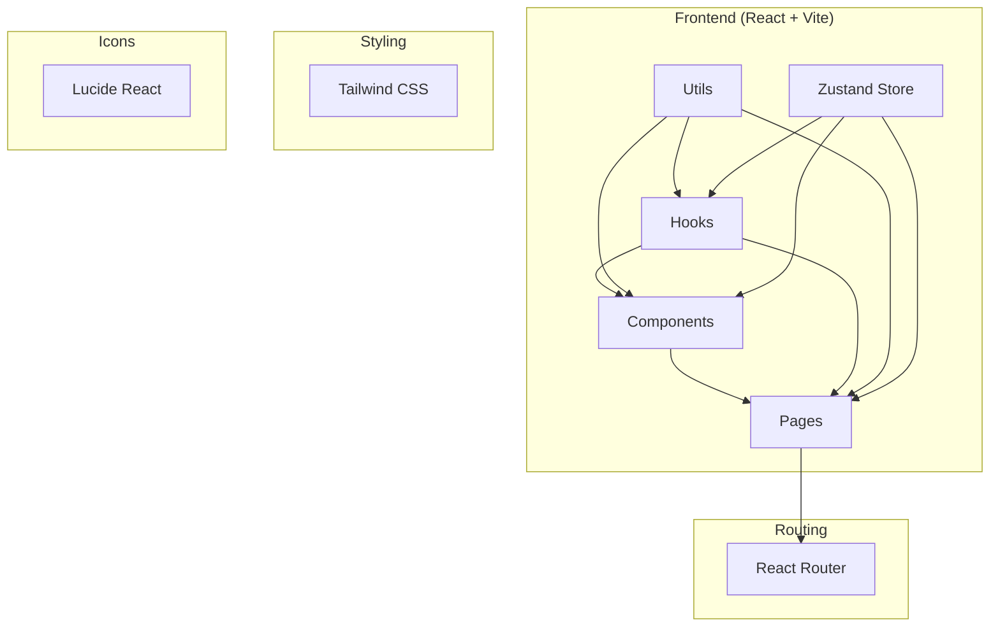

## 1. Architecture Design



## 2. Technology Description
- **Frontend**: React@18 + TypeScript + Tailwind CSS + Vite
- **Initialization Tool**: vite-init
- **Backend**: 暂不实现，使用本地mock数据
- **Database**: 暂不实现
- **State Management**: Zustand
- **Routing**: React Router DOM
- **Icons**: Lucide React

## 3. Route Definitions
| Route | Purpose |
|-------|---------|
| /login | 登录页面 |
| /dashboard | 仪表盘（首页） |
| /metrics | 指标管理 |
| /monitoring | 数据监控 |
| /users | 用户管理（管理员） |

## 4. API Definitions (if backend exists)
暂不实现后端API，使用本地mock数据

## 5. Server Architecture Diagram (if backend exists)
暂不实现后端

## 6. Data Model (if applicable)
暂不实现数据库，使用本地状态管理

### 6.1 Data Model Definition
暂不适用

### 6.2 Data Definition Language
暂不适用

## 7. File Structure
```
/workspace
├── src/
│   ├── components/       # 可复用组件
│   ├── pages/           # 页面组件
│   ├── hooks/           # 自定义Hooks
│   ├── utils/           # 工具函数
│   ├── store/           # Zustand状态管理
│   ├── types/           # TypeScript类型定义
│   ├── App.tsx          # 根组件
│   └── main.tsx         # 入口文件
├── public/              # 静态资源
├── .trae/               # 项目文档
├── index.html           # HTML模板
├── package.json         # 依赖配置
├── tsconfig.json        # TypeScript配置
├── vite.config.ts       # Vite配置
├── tailwind.config.js   # Tailwind配置
└── postcss.config.js    # PostCSS配置
```
