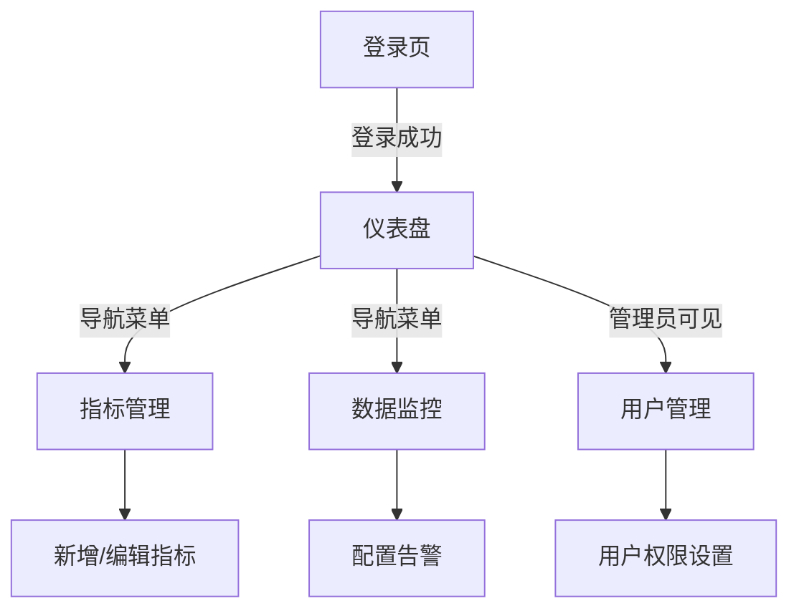

## 1. Product Overview
指标管理系统是一个用于企业指标数据管理、监控和分析的专业平台，帮助用户快速查看业务指标、配置告警规则、生成数据报告。
- 解决企业指标分散管理、数据监控困难的问题，为数据分析师、业务人员和管理员提供统一的指标管理平台
- 提供清晰的指标可视化、实时监控和数据分析功能，提升业务决策效率

## 2. Core Features

### 2.1 User Roles
| Role | Registration Method | Core Permissions |
|------|---------------------|------------------|
| 管理员 | 用户名密码登录 | 完整权限：用户管理、指标配置、系统设置 |
| 普通用户 | 用户名密码登录 | 查看指标、配置个人告警、导出数据 |

### 2.2 Feature Module
1. **登录页**：用户身份验证、记住登录状态
2. **仪表盘**：指标概览、数据可视化卡片、快速操作
3. **指标管理**：指标列表、新增/编辑/删除指标、指标详情
4. **数据监控**：实时数据展示、告警配置、历史趋势
5. **用户管理**（管理员）：用户列表、角色管理、权限配置

### 2.3 Page Details
| Page Name | Module Name | Feature description |
|-----------|-------------|---------------------|
| 登录页 | 登录表单 | 用户名/密码输入、登录按钮、记住我选项、表单验证 |
| 仪表盘 | 指标概览卡片 | 关键指标展示、数据趋势箭头、刷新按钮 |
| 仪表盘 | 快捷操作区 | 快速跳转、常用功能入口 |
| 指标管理 | 指标列表 | 表格展示、搜索筛选、分页 |
| 指标管理 | 指标编辑 | 表单编辑、字段配置、保存取消 |

## 3. Core Process
用户登录系统后进入仪表盘查看关键指标概览，可通过导航进入指标管理模块进行指标配置，在数据监控页面查看实时数据和配置告警。管理员可进入用户管理模块进行权限管理。

## 4. User Interface Design
### 4.1 Design Style
- **主色调**：蓝色系 (#2563eb) 作为主色，传达专业可靠感；深灰 (#1e293b) 作为文字色，浅灰 (#f1f5f9) 作为背景
- **按钮风格**：圆角矩形 (rounded-lg)，主按钮使用蓝色渐变背景，hover有轻微缩放和阴影效果
- **字体**：采用现代无衬线字体，标题使用较大字号和粗体，正文使用中等粗细
- **布局风格**：左侧固定导航栏 + 右侧内容区的经典管理后台布局，卡片式组件展示
- **图标风格**：使用线性图标，简约清晰，与文字对齐

### 4.2 Page Design Overview
| Page Name | Module Name | UI Elements |
|-----------|-------------|-------------|
| 登录页 | 登录表单 | 居中卡片布局，品牌Logo，渐变背景，输入框带图标，按钮有加载状态 |
| 仪表盘 | 指标卡片 | 网格布局，每个指标独立卡片，包含数值、趋势、图标，悬停有轻微上浮效果 |
| 指标管理 | 数据表格 | 表头固定，行hover高亮，操作按钮组，搜索框在顶部 |

### 4.3 Responsiveness
- 桌面端优先设计，适配1024px及以上屏幕
- 响应式适配平板和移动端，导航栏在小屏幕转为汉堡菜单
- 表格在移动端支持横向滚动，卡片在小屏幕单列展示
- 触摸交互优化，按钮和可点击区域足够大

### 4.4 3D Scene Guidance
本项目暂不涉及3D场景
